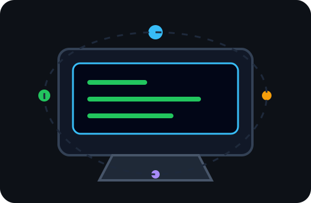
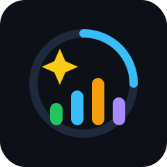
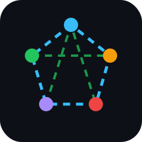
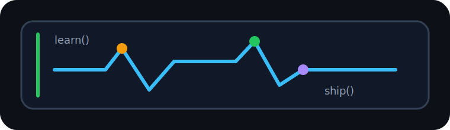

  

  

  

    I build practical web apps, AI-assisted systems, network labs, and digital products with a focus on usefulness, security, and clean user experience.
  

  

    
    
    
  

---

## About Me

- I am a student at the **Faculty of Science and Technology**, **UIN Sultan Maulana Hasanuddin Banten**.
- I explore software engineering, network engineering, artificial intelligence, cybersecurity, and product design.
- I like building projects that solve real problems, not only static demos.
- I am currently improving my fullstack, AI, network security, database, and UI/UX engineering skills.
- Resume / CV: **Coming soon**
- Portfolio Website: **Coming soon**

 

### Connect With Me

  
  
  

---

## My Skills

### Programming Languages

  
  
  
  
  
  
  
  
  
  
  

### Front-End Development & Frameworks

  
  
  
  
  
  
  
  
  
  
  
  
  
  
  

### Backend, Database & API

  
  
  
  
  
  
  

### Network, Security & Infrastructure

  
  
  
  
  
  
  
  
  
  
  
  

### Software, AI & Tools

  
  
  
  
  
  
  
  
  
  
  
  
  
  
  
  

### Operating Systems

  
  
  
  
  
  

---

## Learning Mindset

  

> I do not want to be left behind by technology. I keep training, testing, rebuilding, and learning. Trying is the key; failure is part of the learning process.

---

## GitHub Stats

  
<b>Streak Stats</b>

   
  

    
  

  
<b>GitHub Profile Stats</b>

   
  

    
  

  

    
    
  

## A CAT Eating my Contributions Graph

  

---

## Current Focus

- Fullstack apps with real data flow, authentication, dashboards, and clean interaction.
- AI-assisted systems for education, monitoring, risk analysis, and decision support.
- Network engineering labs, cybersecurity practice, and infrastructure documentation.
- Public repositories as learning records, portfolio proof, and project evolution.

  <b>Learning across software, networks, AI, and security. One project at a time.</b>

